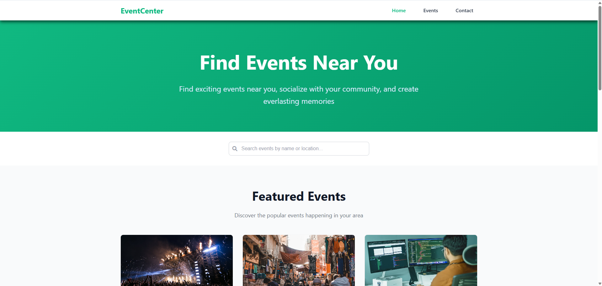
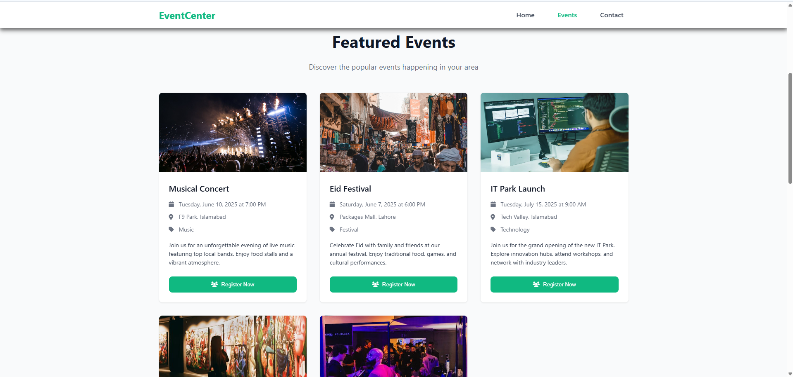
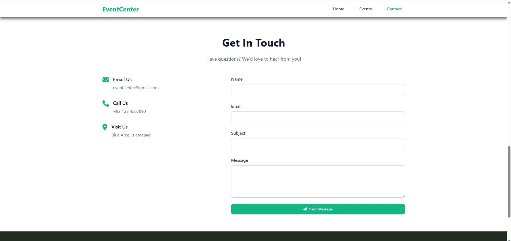
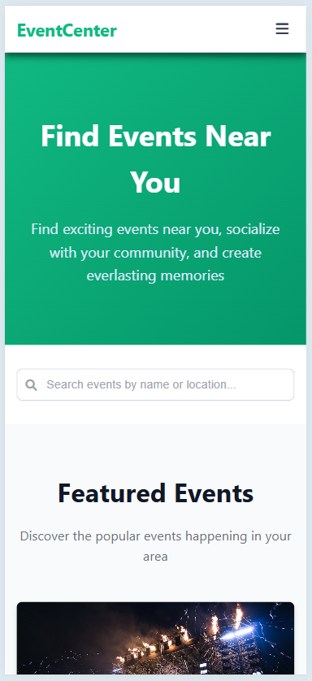
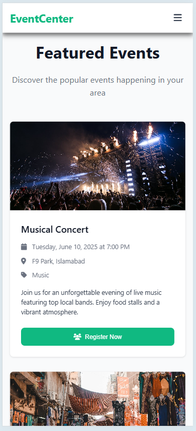
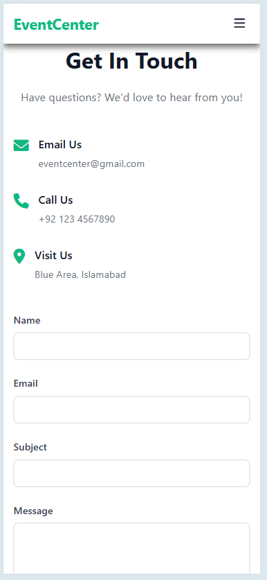
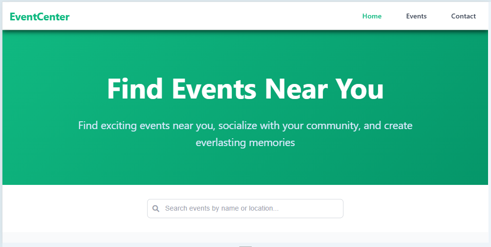
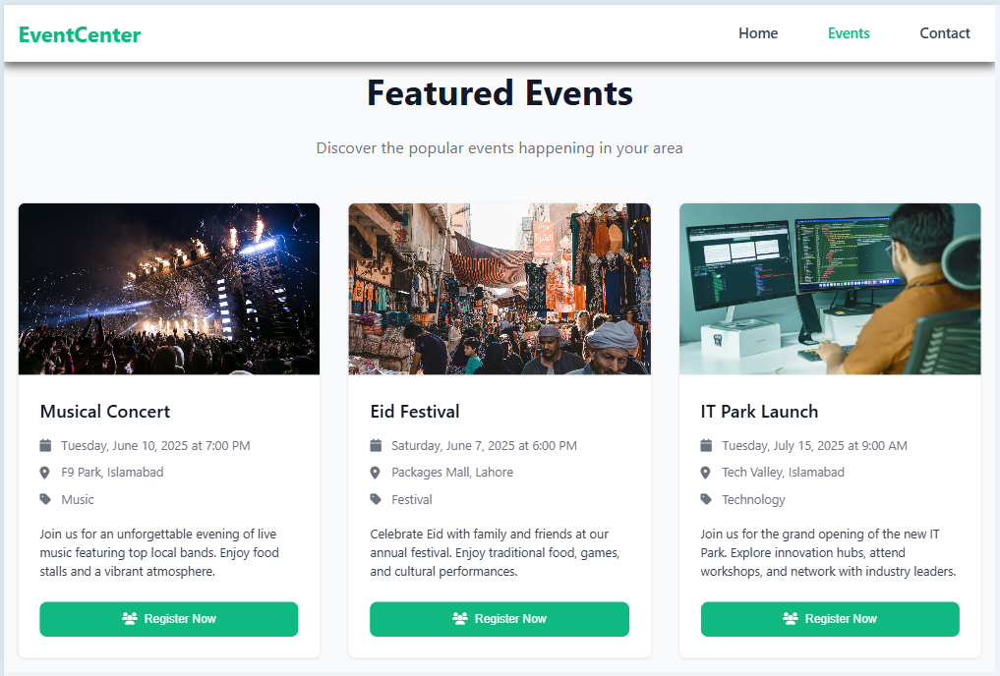
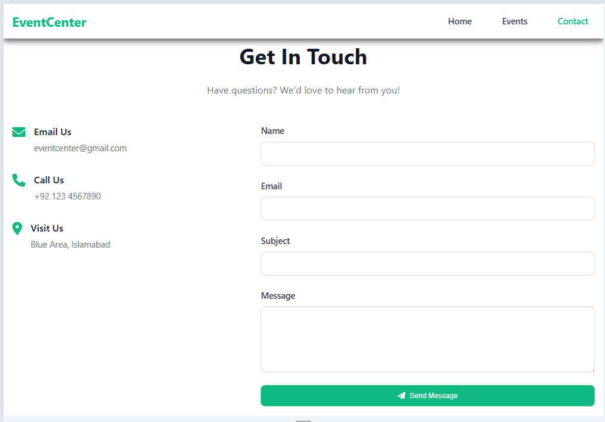

# Event Listing Web App

A modern, responsive event listing web application built using HTML, CSS, and JavaScript. It features a clean, mobile-friendly interface that displays upcoming events, allows for dynamic searching, and includes an elegant contact section.

---

## ✨ Features

* **Responsive Design**: Seamlessly adapts to desktop, tablet, and mobile devices.
* **Event Cards**: Animated cards with event details and registration buttons.
* **Search Functionality**: Real-time filtering of events.
* **Sticky Navbar**: Responsive navigation menu with mobile toggle.
* **Contact Section**: Styled contact form and company information.
* **Subtle Animations**: Smooth fade-in and hover animations for a modern feel.

---

## ⚙ Technologies Used

* **HTML5**: Markup for structure and layout.
* **CSS3**: Custom styles with animations, transitions, and media queries.
* **JavaScript (Vanilla)**: For toggling mobile menu and filtering events.
* **Font Awesome**: Icon library for intuitive UI.

---

## 🔧 How to Run the Project

1. **Clone the repository**:

```bash
git clone https://github.com/NoorUlBaseer/Event-Listing-Web-App.git
cd Event-Listing-Web-App
```

2. **Open in browser**:
   You can simply open `index.html` in your preferred web browser.

> No additional setup or dependencies required.

---

## 🖼️ Screenshots

Add screenshots below to showcase the UI across different devices.

### 🖥️ Desktop View





### 📱 Mobile View





### 🜚 Tablet View





---

## 🚀 Future Enhancements

* Add real-time backend integration using Firebase or a Node.js/Express server.
* Admin dashboard for managing events.
* User authentication and RSVP functionality.

---

## ✉️ Contact

For feedback or collaboration opportunities, feel free to reach out!

---

**License**: This project is licensed under the MIT License - see the [LICENSE](LICENSE) file for details.
